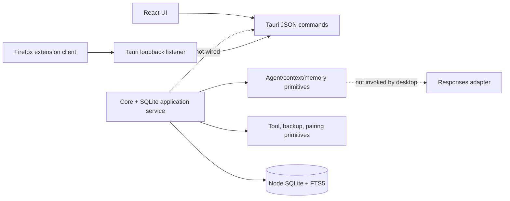
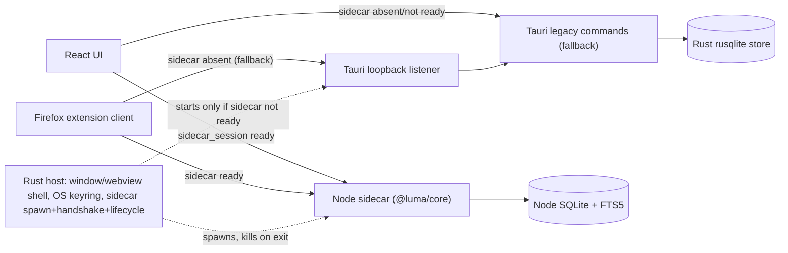

# Architecture

Echo is a local-first single-user desktop agent with three connected runtime slices:

- `@luma/core` provides deterministic TypeScript primitives and a durable Node SQLite application service.
- `apps/desktop` provides a React interface and a Tauri host that starts the packaged Node sidecar, stores credentials, exposes pairing controls, and retains the native Rust SQLite/listener implementation as a startup fallback.
- `apps/firefox-extension` provides a signed-request client. Pairing issuance is exposed in the desktop UI; live installed-package interoperability remains unverified.

When the sidecar starts successfully, `LumaApplicationService` and its SQLite database are authoritative. The native Rust SQLite path is used only when sidecar startup fails.

## Node sidecar

A second, additive path is landing alongside the diagram above: `@luma/core` running as a spawned Node **sidecar** process, owning SQLite persistence and the extension loopback listener directly, so the desktop no longer needs two competing persistence implementations. Full contract, packaging status, and fallback guarantees are in [`docs/SIDECAR.md`](./SIDECAR.md). Status, honestly:

- **Implemented and tested:** Rust spawn/handshake/timeout logic, authenticated RPC, renderer selection, persistence/restart, extension protocol/CORS, bind-conflict handling, migration, and startup fallback.
- **Packaged input verified on Windows:** `pnpm package:sidecar` produces the target-specific `externalBin` used before Tauri packaging. An installed MSI and macOS package remain unverified.

Only one of `Sidecar` and `Listener` is ever bound to `127.0.0.1:43117` at a time — see the port-conflict rule in `docs/SIDECAR.md`.

## Request lifecycle

`LumaApplicationService` durably stores conversations, messages, projects, memories/profile provenance, skill versions, schedules, and audit events and is invoked by the desktop through the sidecar. `LumaAgent` retains the provider abstraction and deterministic context pipeline, but provider-backed replies are not yet connected to the desktop chat path.

## Boundaries

- `@luma/core` contains portable schemas and deterministic primitives. It has no UI or broad filesystem access. It now also ships a Node sidecar entry point (`packages/sidecar`) intended to own SQLite persistence and the extension loopback contract directly, rather than duplicating that logic in Rust.
- Tauri owns the window/webview shell, OS credential access, settings, pairing token controls, and sidecar process lifecycle. The legacy Rust store/commands/listener remain the startup fallback.
- React calls a browser-local adapter in Vite and, in Tauri, resolves to the authenticated sidecar HTTP adapter or native fallback. Automatic backup, notification execution, factory reset, and exports remain illustrative.
- The extension has no provider access or API key. Explicit user actions send bounded page metadata/content with timestamp, nonce and HMAC using a pairing token.
- The core tool runtime rejects unknown tools and declares schemas, risk, permission, confirmation, side effects, timeout, and size. Only the calculator is implemented; the runtime is not connected to model output or the desktop.

## Reliability and privacy

`LumaApplicationService` uses Node’s built-in SQLite API, enables the version-1 schema, maintains FTS rows, persists audit events, and creates authenticated portable backup envelopes. Restore decrypts to staging, checks format/database version and SQLite integrity, restores allowlisted portable files, and swaps with rollback handling. The Tauri host instead stores JSON and offers a separate Argon2/AES-GCM JSON backup command. Automatic backup scheduling/UI are still planned. Diagnostics write an allowlisted environment/system report.

## Cross-platform strategy

Core code uses TypeScript, Web/Node standards, and Node’s built-in cross-platform SQLite API. Credential storage uses Rust `keyring`. Notifications, autostart, Tauri-owned platform data directories, and vector persistence are not implemented. CI defines Windows and macOS package jobs, but those remote jobs and macOS output have not yet been observed. No current component requires Docker.
