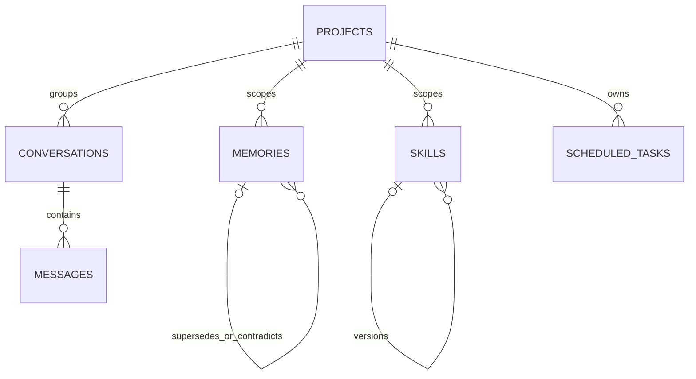

# Database schema

`@luma/core` exports version-1 SQL as `sqliteSchema`. `LumaApplicationService` opens a real database through Node’s built-in SQLite API, applies the schema, and uses transactions for multi-row changes. The Tauri host starts the sidecar that owns this service, and tests close and reopen database files to verify persistence. There is no multi-version migration runner or downgrade path.

## Main relationships

`message_search` and `memory_search` are FTS5 virtual tables. `LumaApplicationService` updates base and FTS rows together for its message/memory operations and uses conversation FTS in tested recall. Embeddings are modeled as optional blobs, but no embedding persistence/index pipeline is implemented.

## Memory invariants

Memory types are profile, semantic, episodic, project, procedural and working. Status is proposed, active, superseded, rejected or deleted. Contradictions create a linked proposed row and do not overwrite the active fact. Confirmed updates link `supersedes_id`, then supersede the former row transactionally. Deletion tombstones the record and clears its content/structured data while the audit event preserves only a non-sensitive action summary. Project-scoped records are retrieved only for their project.

## Skills and permissions

The SQL models immutable skill families/versions and global/project permission rows. `LumaApplicationService` persists skill creation, revisions, and rollback versions. The separate tool runtime supports ask/session/always/deny values in memory; durable permission resolution and project overrides are not implemented.

## Pairing and audit

The schema has a place for a pairing-token hash. The desktop stores the active pairing token in the OS vault; the sidecar/native loopback host verifies timestamps and HMACs, rejects replayed nonces, and enforces the extension request contract. Audit rows are persisted, but append-only database enforcement is not implemented.

## Migration and recovery

Portable restore decrypts into a staging area, validates envelope/database versions and SQLite integrity, replaces the database, restores allowlisted files, and attempts rollback on failure. A general forward-migration framework with disk-space preflight and automatic pre-migration backup remains future work.
