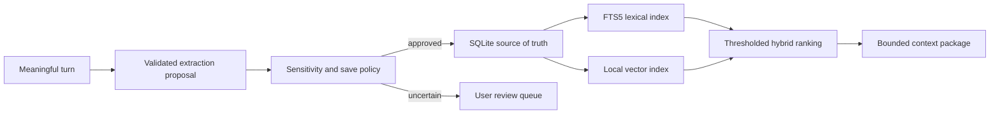

# Memory design

> **Current status:** The core includes a tested in-memory `MemoryStore` for hybrid-score experiments and a durable SQLite `LumaApplicationService` for memory/profile provenance, contradictions, forgetting, FTS conversation recall, project isolation, and close/reopen persistence. The desktop uses the durable service through the sidecar. No embedding pipeline is implemented.

SQLite is the intended authoritative store. The defined schema models profile, semantic, episodic, project, procedural, and working memories with provenance, confidence, importance, sensitivity, lifecycle status, timestamps, contradiction/supersession links, embedding state, and version.

Raw model output is never persisted directly. A strict schema first decides value, type, duration, stated versus inferred status, sensitivity, duplication, contradiction, evidence, confidence, and confirmation need. “Remember this” saves immediately unless prohibited; sensitive inferred facts require confirmation; temporary facts expire; contradictions remain inspectable rather than being overwritten.

Retrieval combines lexical and semantic relevance with recency, confidence, importance, project scope, and prior successful use. Minimum relevance and diversity caps prevent merely similar items from flooding context. Before claiming ignorance, Echo searches the current conversation, profile, active project, relevant memories, conversation summaries, then full conversation text when justified.

Deleting or forgetting deactivates or deletes the requested record according to user choice, removes it from retrieval/indexes, updates derived profile state, and records a secret-free audit event.
