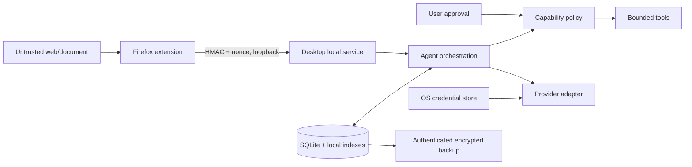

# Security threat model

> **Current status:** The repository implements OS credential storage, persistence-boundary redaction, authenticated backups, HMAC replay checks, strict loopback/CORS handling, pairing UI, path rejection, untrusted-content wrapping, tool validation, and extension-envelope validation. Signed installed-package interoperability, updates, and most tool integrations remain release or future-work boundaries.

## Assets and trust boundaries

Protected assets are API credentials, pairing tokens, local conversations/memories, backups, tool permissions, audit integrity, and the user’s files/accounts. Untrusted inputs include webpages, documents, model output, tool output, imported skills/backups, URLs, filenames, and localhost requests.

## Principal threats and controls

| Threat                                    | Required controls                                                                                                       |
| ----------------------------------------- | ----------------------------------------------------------------------------------------------------------------------- |
| Prompt/tool-output injection              | Separate untrusted context, protected prompt precedence, schema validation, capability checks independent of model text |
| Localhost CSRF or extension impersonation | Loopback bind, strict origin/operation checks, pairing HMAC, nonce replay cache, short timestamp window, rate limits    |
| Secret leakage                            | OS credential vault, redaction, no secrets in DB/logs/exports/frontend/browser, allowlisted diagnostic fields           |
| Oversized/malformed input                 | Byte limits, strict schemas, timeouts, bounded parsing, reject before persistence                                       |
| Path traversal/symlink abuse              | User-selected roots, canonicalize and re-check after open, deny device/network paths by default, atomic writes          |
| Unsafe tool action                        | Least capability, explicit confirmation, project scope, cancellation, append-only audit                                 |
| Database corruption                       | Transactions, migrations, integrity checks, backups, fail closed before partial migration                               |
| Backup tampering/partial restore          | Versioned manifest, AEAD, memory-hard KDF, checksums, staging restore and integrity validation                          |
| Malicious update                          | Signed artifacts, pinned release source, checksum/signature verification; no silent unsigned update                     |

Residual risks include a compromised operating-system account, malicious privileged software reading process memory, and user-approved sharing of sensitive content. Recovery tokens and backup passwords must be stored separately. Security controls must be verified by tests and release review; this document does not itself prove implementation.
