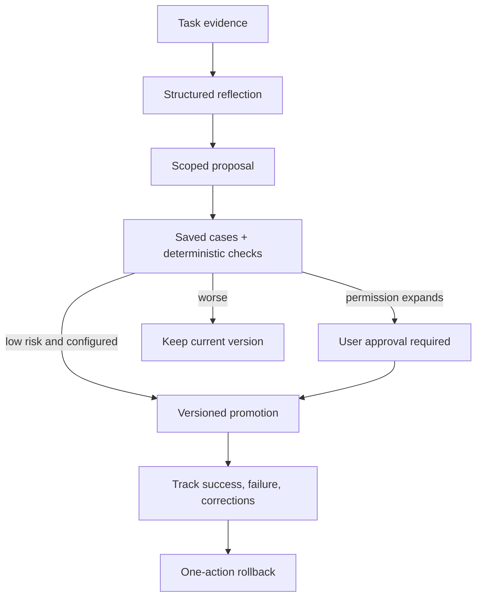

# Controlled self-improvement

> **Current status:** Versioned prompt files and skill primitives exist, but there is no connected reflection engine, proposal persistence, promotion workflow, or post-task execution in the desktop app. This document defines the required boundary for that future integration.

Reflection may improve user-approved preferences, skills, triggers, routing hints, project procedures, templates, retrieval hints, non-security prompt fragments, and workflow checklists. It cannot rewrite application code, protected policies, credential handling, approvals, sandboxing, audit behavior, deletion rules, update mechanisms, or tool boundaries.

After a completed task, a validated reflection records goal, outcome evidence, corrections, workflow/skill used, successful and failed approaches, scope, and a proposed reusable lesson. A proposal is not an applied change.

Model-based evaluation is secondary to deterministic assertions. Auto-promotion, when enabled, is limited to low-risk instruction changes with no new permission or broader scope.
